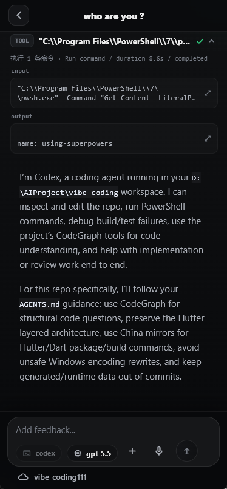
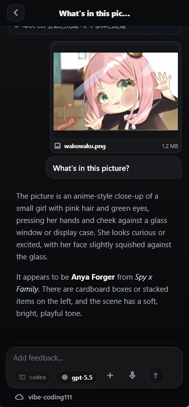

# LAN AI CLI Control

[简体中文](README.zh-CN.md)

LAN AI CLI Control is a local-first mobile control plane for AI coding CLIs. It lets a phone or another LAN device start, resume, inspect, and stop bounded coding conversations while the actual Claude Code, Codex CLI, or OpenCode process stays on the trusted desktop.

The project is intentionally not a remote terminal. The daemon owns workspace authorization, CLI invocation, attachment validation, event persistence, diagnostics, and security boundaries; the Flutter app provides a focused workbench for real coding sessions.

## Screenshots

| Codex conversation | Image prompt |
| --- | --- |
|  |  |

## Why This Exists

Modern coding CLIs are powerful, but their execution context matters. A raw remote shell from a phone is too broad for daily use, and copying prompts between devices loses context. This project keeps the dangerous part local: the daemon runs on the developer machine, limits execution to authorized workspaces, and exposes only the API surface needed for coding workflows.

Use it when you want to:

- Check or continue an active AI coding session away from the keyboard.
- Send follow-up prompts to Claude Code or Codex CLI without exposing arbitrary shell execution.
- Keep workspace, adapter, model, approval, and diagnostic state visible from a mobile UI.
- Attach supported images or text documents to a conversation while preserving daemon-side validation and cleanup.
- Inspect run history, tool output, command activity, diagnostics, and workspace status from the same control surface.

## Current Capabilities

- Pair a mobile device with the local daemon using access and refresh tokens.
- Register, rename, list, and logically delete trusted workspaces per paired device.
- Start and resume conversation-oriented coding sessions for Claude Code and Codex CLI.
- Select supported models when the detected CLI exposes model selection.
- Send text prompts, image attachments, and text-document attachments through capability-checked multipart requests.
- Render user messages, image previews, assistant messages, thinking blocks, tool output, approval cards, task progress, and run errors in the Flutter workbench.
- Persist conversation state and event history in SQLite so sessions survive app restarts.
- Keep low-level lifecycle events in the event log while hiding noisy protocol internals from the main transcript.
- Export redacted diagnostics with trace ids for daemon and mobile failures.
- Provide optional ASR model download endpoints for the mobile voice-input flow.
- Keep legacy bounded task-runner APIs for run queues, command templates, Git status, and Git diff.

## Adapter Support

| Adapter | Conversation support | Resume | Model selection | Attachments | Notes |
| --- | --- | --- | --- | --- | --- |
| Claude Code | Yes | Yes | When `claude` detection reports model flag support | Native images, text extraction, no PDF dispatch | Image bytes are capped at 5 MB before base64 conversion. Mobile input and approval callbacks are supported when the CLI emits them. |
| Codex CLI | Yes | Yes, through `codex exec resume --json` | When both `exec` and `resume` help expose model flags | Native images only when both `exec` and `resume` expose image flags; text extraction is supported; PDF is not dispatched | Codex must be explicitly enabled for daemon adapter listing. The conversation adapter validates CLI JSON support before use. |
| OpenCode | Attach/run surface only | Session id required for run follow-up | No mobile model picker in this path | Depends on OpenCode server behavior | The `/api/conversations` OpenCode adapter is intentionally not implemented yet. Use `OPENCODE_SERVER_URL` for the attach-style adapter surface. |
| Synthetic adapters | Development only | Test behavior | No | Test fixtures | Enabled only with `DEV_ADAPTERS=1`; useful for daemon and UI conformance tests. |

Attachment behavior is capability-driven. The mobile app reads the selected adapter and selected model capability projection before allowing a file to be sent. The daemon then validates the multipart payload again, sniffs file bytes, writes scoped scratch files, commits only metadata to the event log, and cleans scratch data after terminal conversation events.

## Architecture

```text
Flutter mobile app
  -> Daemon HTTP API with pairing-token auth
    -> Workspace registry and SQLite persistence
      -> ConversationManager / RunManager
        -> Claude Code, Codex CLI, OpenCode, or synthetic adapters
          -> Authorized desktop workspace path
```

The repository is split into two main applications:

- `daemon/`: Node.js HTTP daemon, auth, workspace ACLs, adapter orchestration, multipart attachment handling, event stores, diagnostics, task queues, and Git/workspace inspection APIs.
- `mobile/`: Flutter app, connection flow, pairing/token persistence, workbench UI, reducers, repositories, voice input, attachment picker, localization, and widget/unit tests.

Important support directories:

- `scripts/`: Node regression test runner and static checks.
- `docs/`: PRDs, release notes, implementation plans, and architecture notes.
- `images/output/`: README screenshots.
- `data/`: local SQLite/runtime data. Do not commit runtime files.
- `.omx/`: local agent/runtime artifacts. Treat as generated output.

## Security Model

The daemon is designed around a narrow control surface:

- Mobile clients cannot send arbitrary shell commands.
- Mobile clients cannot provide arbitrary `cwd` values.
- Mobile clients cannot pass arbitrary raw CLI arguments.
- The API does not expose a persistent PTY session.
- CLI work is limited to daemon-authorized workspace paths.
- Workspace access is scoped by paired device.
- Pairing uses short-lived pairing codes and token storage with hashed device identity.
- Attachment uploads require capability versions and client message ids.
- Attachment diagnostics and adapter errors are redacted before returning to mobile or diagnostic bundles.
- Release mode disables the development smoke endpoint.

If you bind the daemon to a LAN interface, use a trusted network. The daemon is meant for local control, not public internet exposure.

## Requirements

- Node.js 20 or newer.
- Flutter SDK with Dart `>=3.3.0 <4.0.0`.
- A supported local CLI for real conversations:
  - Claude Code, available as `claude`.
  - Codex CLI, available as `codex`.
  - OpenCode server, when using the attach/run path.
- Optional for voice input: the Sherpa ONNX model ZIP expected by the daemon ASR asset endpoint.

## Quick Start

Install daemon dependencies:

```powershell
npm install
```

Start the daemon on loopback:

```powershell
npm run start:daemon
```

Enable Codex in adapter listing when you want to use Codex CLI:

```powershell
$env:CODEX_ENABLED='1'
$env:CODEX_COMMAND='codex'
npm run start:daemon
```

Use a LAN bind only when a phone must connect to the desktop daemon:

```powershell
$env:DAEMON_HOST='0.0.0.0'
$env:PORT='4317'
npm run start:daemon
```

Windows Firewall may prompt when LAN mode is enabled. Keep the daemon on a trusted network and connect the Flutter app to `http://<desktop-lan-ip>:4317`.

Run the Flutter app from `mobile/`:

```powershell
cd mobile
flutter pub get
flutter run -d windows
```

If you need mainland China mirrors for Flutter package and artifact downloads:

```powershell
$env:PUB_HOSTED_URL='https://pub.flutter-io.cn'
$env:FLUTTER_STORAGE_BASE_URL='https://storage.flutter-io.cn'
flutter pub get
flutter test
```

## Configuration Reference

| Variable | Default | Purpose |
| --- | --- | --- |
| `DAEMON_HOST` | `127.0.0.1` | HTTP bind host. Use `0.0.0.0` only for trusted LAN access. |
| `PORT` | `4317` | HTTP daemon port. |
| `DAEMON_MODE` | `dev` | Runtime mode. Release mode disables development-only smoke APIs. |
| `APP_DB_PATH` | app data default | SQLite path for app data, conversations, workspaces, auth, exceptions, and related state. |
| `CONVERSATION_DB_PATH` | unset | Backward-compatible alias used when `APP_DB_PATH` is not set. |
| `AUTH_TOKEN_SECRET` | generated file secret | Token signing secret. Generated into `.daemon-secrets.json` near the app DB when absent. |
| `DEVICE_ID_PEPPER` | generated file secret | Pepper for device identity hashing. |
| `CLAUDE_COMMAND` | `claude` | Claude Code command or shim path. |
| `CODEX_ENABLED` | disabled | Set to `1` to expose the Codex run adapter in adapter listing. |
| `CODEX_COMMAND` | `codex` | Codex CLI command or shim path. |
| `OPENCODE_SERVER_URL` | `http://127.0.0.1:4096` | OpenCode server URL for the attach/run adapter. |
| `DEV_ADAPTERS` | disabled | Set to `1` to add synthetic adapters for development tests. |
| `CONVERSATION_IDLE_TTL_MS` | `600000` | Idle TTL used by conversation management. |

## API Overview

Public unauthenticated endpoints:

- `GET /api/health`
- `GET /api/version`
- `POST /api/e2e/smoke` in development mode only
- `POST /api/pairing-code`
- `POST /api/pair`
- `POST /api/token/refresh`

Authenticated device endpoints:

- `GET /api/adapters`
- `GET /api/extensions`
- `GET /api/workspaces`
- `POST /api/workspaces`
- `PATCH /api/workspaces/:workspaceId`
- `DELETE /api/workspaces/:workspaceId`
- `GET /api/fs/roots`
- `GET /api/fs/children`
- `GET /api/workspaces/:workspaceId/overview`
- `GET /api/workspaces/:workspaceId/files/tree`
- `GET /api/workspaces/:workspaceId/files/content`
- `GET /api/workspaces/:workspaceId/diagnostics/code`
- `GET /api/workspaces/:workspaceId/git/status`
- `GET /api/workspaces/:workspaceId/git/diff`
- `GET /api/workspaces/:workspaceId/git/commits`
- `GET /api/conversations`
- `POST /api/conversations`
- `PATCH /api/conversations/:conversationId/model`
- `GET /api/conversations/:conversationId/events?afterSeq=0`
- `POST /api/conversations/:conversationId/messages`
- `POST /api/conversations/:conversationId/questions/respond`
- `POST /api/conversations/:conversationId/approvals/:approvalId/respond`
- `POST /api/conversations/:conversationId/cancel`
- `GET /api/runs`
- `POST /api/runs`
- `GET /api/runs/:runId/events?afterSeq=0`
- `POST /api/runs/:runId/input`
- `POST /api/runs/:runId/cancel`
- `POST /api/approvals/:approvalId/respond`
- `GET /api/queue`
- `GET /api/shortcuts`
- `POST /api/shortcuts`
- `GET /api/command-templates`
- `POST /api/command-templates`
- `POST /api/command-templates/:templateId/invoke`
- `POST /api/diagnostics/export`
- `POST /api/exceptions`
- `GET /api/asr-model`
- `GET /api/asr-model/download`
- `POST /api/devices/{deviceId}/revoke` for the authenticated device

`/api/conversations` is the primary surface for mobile coding sessions. `/api/runs` remains a bounded compatibility/task-runner surface.

## Attachment Pipeline

The conversation message endpoint accepts JSON for text-only messages and `multipart/form-data` for attachments. Multipart sends include:

- `clientMessageId`, used for idempotency and mobile optimistic-message reconciliation.
- `capabilityVersion`, used to reject stale client assumptions about the selected adapter/model.
- Declared attachment metadata.
- File bytes in the expected multipart order.

Current validation includes:

- Flat, normalized display names with no path separators, control characters, bidi controls, trailing spaces/dots, or Windows reserved device names.
- PNG, JPEG, WebP, PDF, and supported text sniffing.
- Image dimension limits of 16,384 by 16,384 and 40 million pixels.
- Mobile-side size limits: Claude images 5 MB, other image-capable paths 10 MB, text documents 1 MB, total multipart selection 20 MB.
- Pre-commit rejection for unsupported kinds, malformed payloads, stale capability versions, missing files, and oversized or invalid bytes.
- Scratch cleanup on terminal conversation events, cancellation, and relevant failure paths.

## Development Commands

Run daemon checks from the repository root:

```powershell
npm run lint
npm test
```

Run Flutter checks from `mobile/`:

```powershell
flutter analyze
flutter test
dart run tool/check_architecture_imports.dart
```

For local Windows desktop builds:

```powershell
cd mobile
flutter build windows --debug
```

## Testing Strategy

- Daemon protocol, adapter, auth, attachment, persistence, and security-boundary behavior lives in `scripts/run-tests.js` and `daemon/test/`.
- Flutter model parsing, reducers, ViewModels, widget behavior, and architecture import checks live in `mobile/test/`.
- Attachment regressions should include both daemon multipart tests and mobile rendering/state tests when the bug crosses the HTTP boundary.
- Keep tests close to the failure surface: daemon for committed protocol behavior, mobile for projection and UI behavior.

## ASR and Voice Input

The mobile app includes a voice-input path backed by Sherpa ONNX. The daemon serves model metadata and ranged downloads from:

- `GET /api/asr-model`
- `GET /api/asr-model/download`

By default the daemon expects `daemon/asset/sherpa-onnx-streaming-zipformer-bilingual-zh-en-2023-02-20-mobile.zip`. If the file is missing, the API returns a structured `ASR_MODEL_UNAVAILABLE` error with a user action instead of silently failing.

## Current Status and Limits

- The app is optimized for LAN and local development workflows.
- Claude and Codex conversation paths are the main supported coding surfaces.
- OpenCode is present as an attach/run adapter, not as a full conversation adapter.
- PDF metadata and validation exist, but current production conversation dispatch does not send PDFs to Claude or Codex.
- The daemon does not provide TLS by itself. Keep it behind a trusted LAN or a transport you control.
- Runtime SQLite data, pairing secrets, `.omx/`, diagnostic bundles, and build outputs should not be committed.

## Repository Hygiene

Before committing code changes, run the checks relevant to the touched layer. For Flutter architecture changes, include:

```powershell
cd mobile
dart run tool/check_architecture_imports.dart
flutter analyze
flutter test
```

For daemon API, adapter, attachment, auth, or persistence changes, include:

```powershell
npm run lint
npm test
```

Keep generated runtime data out of Git, and preserve tests around `cwd`, permissions, stdin handling, event replay, attachment redaction, and protocol filtering.
