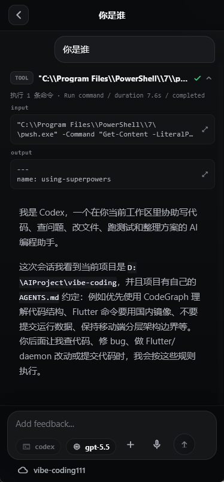
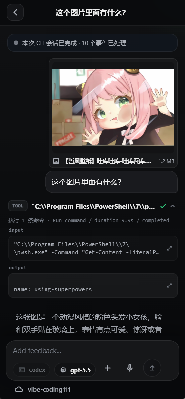

<!-- DREAMFIELD_README_HEADER_START -->

<p align="center">
  <a href="https://www.dreamfield.top">
    
  </a>
</p>

<!-- DREAMFIELD_README_HEADER_END -->

# Vibe Coding

[English](README.md)

Vibe Coding 是一个局域网优先的移动端 AI 编程 CLI 控制面。它让手机或同一可信 LAN 内的设备可以启动、继续、观察和停止有边界的编程会话，而真正的 Claude Code、Codex CLI 或 OpenCode 进程仍然运行在拥有工作区的开发机上。

它不是远程终端。Node daemon 会把执行限制在已授权的桌面工作区内，负责配对与 token 校验、附件验证、事件持久化，并且只暴露 Flutter 工作台所需的 HTTP/WebSocket 能力。

## 效果图

| Codex 会话 | 带图片提问 |
| --- | --- |
|  |  |

## 它能做什么

- 通过短期 pairing code、access token 和 refresh token，把 Flutter 客户端连接到本地 daemon。
- 让每台已配对设备注册、重命名、列出和逻辑删除自己的可信工作区。
- 为 Claude Code 和 Codex CLI 启动、继续和取消会话式编程任务。
- 通过 WebSocket conversation notification、持久化事件 replay 和 REST backfill 保持工作台实时更新。
- 展示 assistant 消息、thinking block、工具输出、命令卡片、task progress、approval prompt、用户问题、run error 和附件预览。
- 通过 capability 校验后的 multipart 请求发送文本 prompt、图片附件和受支持的文本文件。
- 保留受边界约束的兼容 run 表面，用于队列、shortcut、command template、Git status、Git diff 和 OpenCode attach/run。
- 通过 daemon 托管的 Sherpa ONNX ASR 模型提供移动端语音输入，支持断点下载和最终文本纠错。
- 通过已配对 daemon 提供私有 Android APK 更新通道，支持 manifest 检查、断点下载、SHA-256 校验和 Android 安装器交接。
- 导出带 trace id 的脱敏 diagnostics，覆盖 daemon 和 mobile 侧异常。

## 系统结构

```text
Flutter mobile app
  -> Node daemon HTTP API + WebSocket notifications
    -> pairing auth、device-scoped workspaces、SQLite state
      -> ConversationManager / RunManager
        -> Claude Code、Codex CLI、OpenCode 或 synthetic adapters
          -> 已授权的桌面 workspace path
```

主要目录：

- `daemon/`: Node.js daemon、HTTP API、WebSocket notification hub、认证、workspace registry、CLI adapters、附件校验、SQLite 持久化、诊断、ASR 资产和 Android 更新托管。
- `mobile/`: Flutter 应用、连接流程、repository、ViewModel、工作台 UI、附件选择器、语音输入、App 更新流程、本地化和测试。
- `scripts/`: daemon 回归测试 runner、静态检查和 Android 更新打包工具。
- `docs/`: 设计说明、PRD、项目知识、发布手册和实现计划。
- `images/output/`: README 效果图。
- `data/`: 本地运行时 SQLite 数据。不要提交生成的运行时文件。
- `.omx/`: 本地 agent/runtime 产物，按生成文件处理。

## Adapter 支持

| Adapter | Conversation 支持 | Resume | 模型选择 | 附件 | 当前说明 |
| --- | --- | --- | --- | --- | --- |
| Claude Code | 支持 | 支持 | 当检测到的 CLI capability 暴露模型选择时可用 | 图片和文本抽取；PDF 会校验但不分发 | 图片在 base64 转换前限制为 5 MB。CLI 发出的 question 和 approval 会投影到工作台。 |
| Codex CLI | 支持 | 通过 `codex exec resume --json` 支持 | 当 `exec` 和 `resume` help 都暴露 model flag 时可用 | 只有检测到 CLI 支持 image flag 时才启用图片；支持文本抽取；不分发 PDF | Codex 已支持 conversation path，也可以通过 `CODEX_ENABLED=1` 暴露在旧 run adapter 列表中。 |
| OpenCode | 仅 attach/run 表面 | follow-up 需要 OpenCode session id | 当前路径没有移动端 model picker | 取决于 OpenCode server | `/api/conversations` 当前对 OpenCode 有意返回未实现。attach/run adapter 通过 `OPENCODE_SERVER_URL` 配置。 |
| Synthetic adapters | 开发和测试 | 测试行为 | 无 | 测试 fixture | 通过 `DEV_ADAPTERS=1` 启用，用于 daemon/UI 一致性检查和 smoke tests。 |

附件是否可用由选中 adapter 和 model 的 capability projection 决定。移动端会先阻止明显不支持的选择，daemon 在真正分发给 CLI 前还会再次校验 multipart payload。附件 bytes 会被嗅探、写入受作用域限制的 scratch storage，只把元数据写进事件日志，并在终端会话事件或相关失败后清理。

## 环境要求

- Node.js 20 或更高版本。
- Flutter SDK，Dart 版本范围为 `>=3.3.0 <4.0.0`。
- 至少安装一个用于真实编程会话的本地 CLI：
  - Claude Code，可通过 `claude` 调用。
  - Codex CLI，可通过 `codex` 调用。
  - 使用 attach/run adapter 时需要 OpenCode server。
- 可选语音输入资产：`daemon/asset/sherpa-onnx-streaming-zipformer-bilingual-zh-en-2023-02-20-mobile.zip`。
- 可选 Android 更新发布签名：`mobile/android/key.properties` 和对应 release keystore。

## 快速开始

在仓库根目录安装 daemon 依赖：

```powershell
npm install
```

以 loopback 模式启动 daemon：

```powershell
npm run start:daemon
```

如果还想在旧 run 表面中暴露 Codex adapter：

```powershell
$env:CODEX_ENABLED='1'
$env:CODEX_COMMAND='codex'
npm run start:daemon
```

只有其他设备需要连接时，才绑定到 LAN：

```powershell
$env:DAEMON_HOST='0.0.0.0'
$env:PORT='4317'
npm run start:daemon
```

本地 LAN 开发也可以使用 Windows helper：

```powershell
.\start-daemon.bat
```

从 `mobile/` 运行 Flutter 应用：

```powershell
cd mobile
flutter pub get
flutter run -d windows
```

中国大陆网络环境下，Flutter/Dart 命令如果会解析包或下载 artifact，建议使用镜像：

```powershell
cd mobile
$env:NO_PROXY='localhost,127.0.0.1,::1'
$env:no_proxy='localhost,127.0.0.1,::1'
$env:PUB_HOSTED_URL='https://pub.flutter-io.cn'
$env:FLUTTER_STORAGE_BASE_URL='https://storage.flutter-io.cn'
flutter pub get
flutter test
```

## 配置

| 变量 | 默认值 | 用途 |
| --- | --- | --- |
| `DAEMON_HOST` | `127.0.0.1` | HTTP bind host。只有可信 LAN 访问时才使用 `0.0.0.0`。 |
| `PORT` | `4317` | daemon HTTP 端口。 |
| `DAEMON_MODE` | `dev` | 运行模式。development mode 会启用 smoke endpoint。 |
| `APP_DB_PATH` | app data 默认路径 | SQLite 路径，保存 app、auth、workspace、conversation、exception 等状态。 |
| `CONVERSATION_DB_PATH` | 未设置 | 兼容旧版本的别名，仅在未设置 `APP_DB_PATH` 时使用。 |
| `AUTH_TOKEN_SECRET` | 自动生成的文件 secret | token 签名 secret。缺失时会在 app DB 附近生成。 |
| `DEVICE_ID_PEPPER` | 自动生成的文件 secret | 设备身份 hash 使用的 pepper。 |
| `ACCESS_TOKEN_TTL_MS` | 7 天 | access token 生命周期。 |
| `REFRESH_TOKEN_TTL_MS` | 30 天 | refresh token 生命周期。 |
| `CLAUDE_COMMAND` | `claude` | Claude Code 命令或 shim 路径。 |
| `CODEX_COMMAND` | `codex` | Codex CLI 命令或 shim 路径。 |
| `CODEX_ENABLED` | 未启用 | 设置为 `1` 后在 adapter listing 中暴露 Codex legacy run adapter。 |
| `OPENCODE_SERVER_URL` | `http://127.0.0.1:4096` | OpenCode attach/run adapter 使用的 server 地址。 |
| `DEV_ADAPTERS` | 未启用 | 设置为 `1` 后加入 synthetic adapters，用于开发和测试。 |
| `CONVERSATION_IDLE_TTL_MS` | `600000` | conversation 管理使用的 idle TTL。 |
| `ANDROID_UPDATE_ARTIFACT_DIR` | `daemon/update-artifacts/android` | Android 更新 `latest.json`、APK 和 `.sha256` artifact 所在目录。 |

## API 表面

daemon 暴露的是产品级操作，而不是通用 shell：

- 健康检查与配对：`GET /api/health`、`GET /api/version`、`POST /api/pairing-code`、`POST /api/pair`、`POST /api/token/refresh`。
- 工作区与文件：`/api/workspaces`、`/api/fs/roots`、`/api/fs/children`，以及授权 workspace 下的 overview、tree、content、diagnostics、Git status、diff 和 commits。
- 会话：`/api/conversations`、`/api/conversations/:conversationId/events`、`/messages`、`/questions/respond`、`/approvals/:approvalId/respond`、`/cancel` 和 `/model`。
- 实时通知：在 `/api/notifications/ws` 进行 WebSocket upgrade，使用 bearer-token auth，并支持 scoped `conversation.events` subscription。
- 兼容 run：`/api/runs`、`/api/runs/:runId/events`、`/input`、`/cancel`、`/api/queue`、`/api/shortcuts` 和 `/api/command-templates`。
- 诊断与客户端异常：`POST /api/diagnostics/export` 和 `POST /api/exceptions`。
- 私有 Android 更新：`GET /api/app-updates/android/latest`、`HEAD /api/app-updates/android/apk/:versionCode` 和 `GET /api/app-updates/android/apk/:versionCode`。
- 语音模型资产：`GET /api/asr-model` 和 `GET /api/asr-model/download`。

`/api/conversations` 是主要编程会话表面。`/api/runs` 保留给受边界约束的旧 task-runner 和 attach-style workflow。

## 安全模型

- 移动端不能发送任意 shell 命令。
- 移动端不能指定任意 `cwd`，也不能透传原始 CLI 参数。
- API 不暴露持久 PTY。
- CLI 执行限制在 daemon 授权过的 workspace path 内。
- workspace 访问按 paired device 隔离。
- 配对使用短期 code，设备身份以 hash 形式存储。
- 附件上传必须携带 capability version 和 client message id。
- 附件 diagnostics 和 adapter error 会在返回移动端或进入 diagnostic bundle 前脱敏。
- development-only smoke API 在非 development mode 下会被禁用。

如果把 daemon 绑定到 LAN 网卡，请只在可信网络内使用。daemon 自身不提供 TLS，不应该直接暴露到公网。

## 开发检查

在仓库根目录运行 daemon 检查：

```powershell
npm run lint
npm test
node scripts/check-project-knowledge.js
git diff --check
```

在 `mobile/` 下运行 Flutter 检查：

```powershell
cd mobile
$env:NO_PROXY='localhost,127.0.0.1,::1'
$env:no_proxy='localhost,127.0.0.1,::1'
$env:PUB_HOSTED_URL='https://pub.flutter-io.cn'
$env:FLUTTER_STORAGE_BASE_URL='https://storage.flutter-io.cn'
dart run tool/check_architecture_imports.dart
flutter analyze
flutter test
```

Windows debug build：

```powershell
cd mobile
flutter build windows --debug
```

Android 更新包：

```powershell
npm run package:android-update -- -VersionName 1.4.2 -VersionCode 4
```

## 文档

- [项目知识索引](docs/project-knowledge/index.md): 架构、构建/测试规则、决策、风险和排障入口。
- [Android 在线更新发布手册](docs/android-online-update-release-guide.md): 私有 APK 更新打包和真机 smoke 流程。
- [AI CLI 控制命令笔记](docs/ai_cli_control_commands_claude_codex_opencode.md): 面向 adapter 的 CLI 行为记录。
- [v1.3 PRD](docs/prd/flutter_lan_ai_cli_control_v1_3_prd.md): 当前一代移动控制面的产品需求。

## 当前限制

- 产品面向本地/LAN 开发工作流，不适合公网托管。
- OpenCode 当前是 attach/run adapter，不是完整 conversation adapter。
- PDF 文件可以作为附件被校验，但生产 conversation dispatch 不会把 PDF 发送给 Claude 或 Codex。
- ASR API 需要在 `daemon/asset/` 下放置预期模型 ZIP；资产缺失时会返回结构化 `ASR_MODEL_UNAVAILABLE` 错误。
- Android 更新需要正常的 Android 系统安装确认。普通设备不支持静默安装。
- SQLite runtime data、生成的 pairing secret、`.omx/`、diagnostic bundle、APK artifact 和 build output 都不应进入 Git。

## License

当前仓库没有单独的 `LICENSE` 文件。
